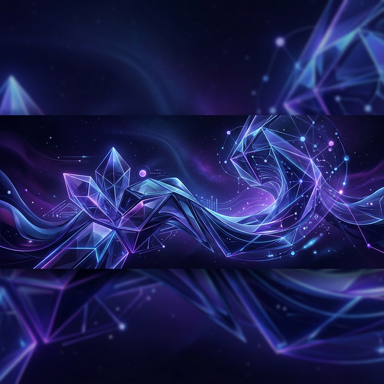
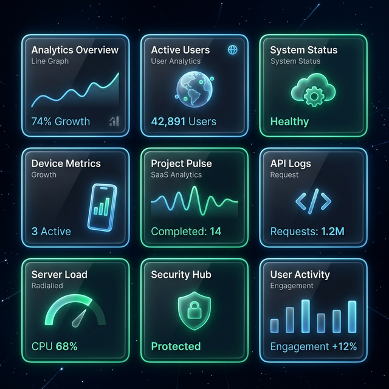
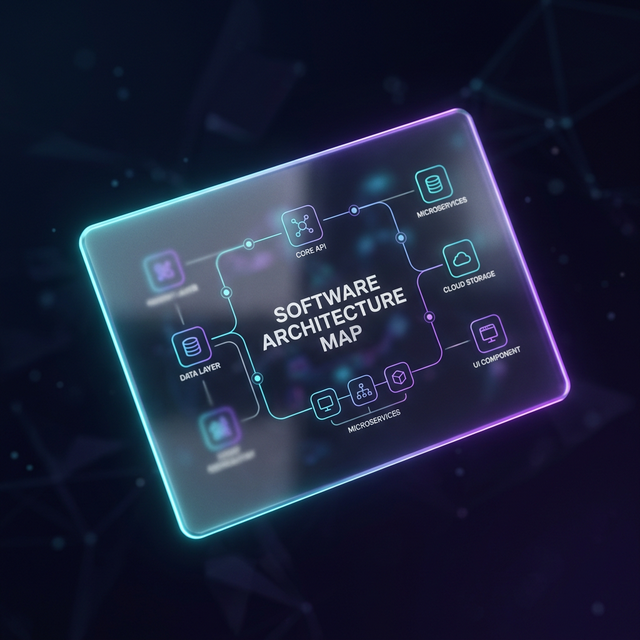

<div align="center">



# 🌌 NOON Digital - Digitalize Everything

[](https://nextjs.org/)
[](https://tailwindcss.com/)
[](https://www.framer.com/motion/)
[](https://www.typescriptlang.org/)

**A premium, high-performance digital agency landing page built with a "Liquid Glass" design aesthetic.**

[Live Demo](https://aartechsaas.vercel.app/) • [Report Bug](https://github.com/yahyeameer/aartechsaas/issues) • [Request Feature](https://github.com/yahyeameer/aartechsaas/issues)

</div>

---

## ✨ Design Philosophy: Liquid Glass

NOON Digital is built on the **Liquid Glass** aesthetic—a design system that combines the clarity of glassmorphism with the fluid motion of modern physics-based animations.

### Key Visual Pillars
- **Depth & Dimension**: Using `backdrop-blur-xl` and multi-layered shadows to create a tangible 3D space.
- **Fluid Interaction**: Physics-based magnetic elements that respond to user intent.
- **Chromatic Ambient**: Subtle, pulsating aurora gradients that provide a "living" background.

---

## 🚀 Interactive Features

<div align="center">
<table>
  <tr>
    <td width="50%">
      <h3>3D Interactive Bento Grid</h3>
      <p>A sophisticated services grid where cards react to mouse position with smooth 3D tilting and dynamic spotlight glows.</p>
    </td>
    <td width="50%">
      
    </td>
  </tr>
  <tr>
    <td width="50%">
      
    </td>
    <td width="50%">
      <h3>Magnetic Interactions</h3>
      <p>Custom-engineered magnetic hooks that pull icons and buttons toward the cursor, creating an elite tactile experience.</p>
    </td>
  </tr>
</table>
</div>

---

## 🛠️ Tech Stack

- **Framework**: [Next.js 15 (App Router)](https://nextjs.org/)
- **Styling**: [Tailwind CSS](https://tailwindcss.com/)
- **Animations**: [Framer Motion](https://www.framer.com/motion/)
- **Icons**: [Lucide React](https://lucide.dev/)
- **Components**: [Shadcn UI](https://ui.shadcn.com/)
- **Deployment**: [Vercel](https://vercel.com/)

---

## ⚙️ Getting Started

### Prerequisites
- Node.js 18+ 
- npm / pnpm / yarn

### Installation

1. **Clone the repository**
   ```bash
   git clone https://github.com/yahyeameer/aartechsaas.git
   ```

2. **Install dependencies**
   ```bash
   npm install
   ```

3. **Run the development server**
   ```bash
   npm run dev
   ```

4. **Open the browser**
   Navigate to [http://localhost:3000](http://localhost:3000)

---

## 📦 Project Structure

```text
├── app/              # Next.js App Router (Pages & Layout)
├── components/       # Reusable UI Components
│   ├── home/         # Home page specific sections
│   └── ui/           # Atomized UI elements (Buttons, Cards)
├── public/           # Static assets (Images, SVGs)
├── lib/              # Utility functions & Shared logic
└── convex/           # Backend schema & functions
```

---

<div align="center">
  <p>Built with ❤️ by NOON Digital Team</p>
  <p>© 2026 NOON Digital. All rights reserved.</p>
</div>
